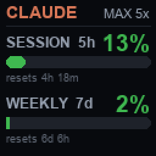

# divoom-widgets

Show your **Claude usage** — current **session (5-hour)** and **weekly (7-day)**
limits — on a **[Divoom Times Gate](https://divoom.com/)** WiFi pixel-art display.

The Times Gate has five 128×128 LCD panels. This project renders a compact usage
card and draws it onto one panel over the device's local network API — no cloud,
no Anthropic API key.

<p align="center">
  
</p>

> Built and tested against a Claude **Max** plan; the same code works on **Pro**
> (the plan badge just reads `PRO`). See [Pro vs Max](docs/research.md#pro-vs-max).

---

## Features

- **No API/Admin key.** Reads the OAuth token Claude Code already stores locally
  and calls the same endpoint its `/usage` command uses.
- **Session + weekly** rolling-window usage, each with a color-coded bar and a
  reset countdown.
- Draws to **any one of the five panels** (`--panel 1..5`).
- Auto-refreshes the Claude token when it expires.
- Bonus: **Divoom Keeper**, a tray app for pushing images/GIFs to the panels.

## Components

| Module | What it is | Run with |
|--------|------------|----------|
| `usage_widget/` | The Claude usage widget (this README's focus) | `python -m usage_widget` |
| `divoom_keeper/` | Tray app to send images/GIFs to the 5 panels on a schedule | `python -m divoom_keeper` |

## Requirements

- Python 3.9+
- A Divoom Times Gate (or Pixoo-style device) on the same LAN
- For Claude data: [Claude Code](https://claude.com/claude-code) installed and
  logged in (Pro or Max) so an OAuth token exists at `~/.claude/.credentials.json`

## Install

```bash
git clone https://github.com/cosmincucu/divoom-widgets
cd divoom-widgets
pip install -r requirements.txt        # or: pip install -e .
cp .env.example .env                    # then edit (at minimum DIVOOM_HOST)
```

Find your device's LAN IP from the Divoom app, or:

```bash
curl https://app.divoom-gz.com/Device/ReturnSameLANDevice   # lists devices on your public IP
```

## Quick start

```bash
# Render only — no device needed — and inspect the image:
python -m usage_widget --once --no-push --save preview.png

# Push once to the middle panel:
python -m usage_widget --once --panel 3

# Run continuously (defaults from .env):
python -m usage_widget
```

### CLI

| Flag | Meaning |
|------|---------|
| `--once` | one update, then exit |
| `--panel N` | draw on panel N (1–5); overrides `WIDGET_PANEL` |
| `--host IP` | Times Gate IP; overrides `DIVOOM_HOST` |
| `--interval S` | seconds between updates |
| `--save PATH` | also save the rendered PNG |
| `--no-push` | render only; don't contact the device |

## Configuration

All via `.env` (see [.env.example](.env.example)):

| Variable | Default | Notes |
|----------|---------|-------|
| `DIVOOM_HOST` | `192.168.1.50` | Times Gate IP on your LAN |
| `WIDGET_PANEL` | `1` | Which of the 5 panels (1–5) |
| `UPDATE_INTERVAL_SECONDS` | `300` | Refresh interval (min 15) |
| `CLAUDE_CREDENTIALS_PATH` | `~/.claude/.credentials.json` | Override only if non-standard |
| `GITHUB_OAUTH_TOKEN` / `GITHUB_USERNAME` | — | Optional, for the Copilot provider |

Claude needs **nothing** beyond being logged into Claude Code.

## Deployment

The widget just needs to run unattended somewhere that (a) is on the device's
LAN and (b) can get your Claude token.

### Windows — run at login

Hide the console with `pythonw` and register a logon task:

```powershell
# from the repo folder
schtasks /create /tn "DivoomUsageWidget" /sc onlogon /rl limited ^
  /tr "pythonw -m usage_widget" /f
```

It reads/refreshes the token from `~/.claude/.credentials.json` (kept fresh by
Claude Code), so no token config is needed. Remove with
`schtasks /delete /tn DivoomUsageWidget /f`.

### Docker — always-on (e.g. homelab)

No Claude Code install needed on the host — pass a long-lived token instead:

```bash
claude setup-token                 # prints an sk-ant-oat01-... token (run anywhere)

export CLAUDE_CODE_OAUTH_TOKEN=sk-ant-oat01-...
export DIVOOM_HOST=192.168.1.50 WIDGET_PANEL=3
docker compose up -d --build
```

The container reaches the device by LAN IP, so default bridge networking is fine
as long as the Docker host can route to it. See
[`docker-compose.yml`](docker-compose.yml).

> There is **no Divoom-store deployment** — the community gallery only accepts
> pixel art / clock faces, and live data feeds are Divoom-built. A private
> usage widget must run as your own pusher like this. See
> [docs/research.md](docs/research.md).

## How it works

```
Claude OAuth usage endpoint ─► render 128×128 image ─► Draw/SendHttpGif ─► one panel
```

- **Claude data** comes from `GET https://api.anthropic.com/api/oauth/usage`
  using the local Claude Code OAuth token (`anthropic-beta: oauth-2025-04-20`).
  It returns 5-hour and 7-day *utilization* percentages.
- **Display:** `Draw/SendHttpGif` + a 5-element `LcdArray` targets one panel with
  a 128×128 JPEG. Current firmware replies `{"error_code":"DeviceToken is err"}`
  but still applies the draw, so that code is treated as success.

Full details, response shapes, and the optional GitHub Copilot provider are in
**[docs/research.md](docs/research.md)**.

## Divoom Keeper (bonus)

A small system-tray app to assign an image/GIF to each of the five panels and
re-send them on a schedule or at startup. Needs the `keeper` extra:

```bash
pip install -e ".[keeper]"   # adds pystray
python -m divoom_keeper
```

## Development

```bash
pip install -e ".[dev]"
pytest
```

Tests cover the rendering, parsing, and device helpers and run without any
network or device.

## Disclaimer

Not affiliated with Anthropic, GitHub, or Divoom. The Claude usage endpoint is
an **internal** endpoint used by Claude Code, not a published API — it may change
or break at any time. Use responsibly with your own account.

## License

[MIT](LICENSE)
