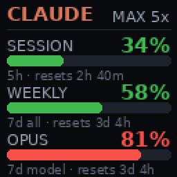
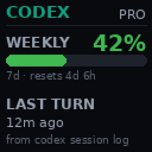
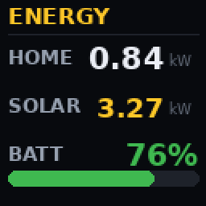

# divoom-widgets

A small **widget framework** for the **[Divoom Times Gate](https://divoom.com/)**
WiFi pixel display: each widget renders a 128×128 card and owns one of the five
LCD panels, refreshing on its own interval over the device's local network API —
no cloud, no API keys.

Widgets included:

- **Claude usage** — current **session (5-hour)**, **weekly (7-day)** and, when
  the plan reports one, the **per-model weekly** limit utilization for a Claude
  **Pro/Max** plan, straight from the OAuth endpoint Claude Code's `/usage`
  command uses.
- **Codex usage** — the **weekly plan limit** of an OpenAI **ChatGPT/Codex**
  subscription, read from the `token_count` events Codex writes into its own
  session transcripts — via a **SigNoz** log store those transcripts are shipped
  to (Codex has no usage endpoint a widget can call).
- **Home energy** — current **house load**, **solar generation**, and **battery
  state of charge** from **Home Assistant** (e.g. a Tesla Powerwall).

Optionally, every widget's numbers are also posted as **OTLP metrics** to a
collector (`LO_ENDPOINT`), so the percentages the panels show keep a history
in your metrics store.

<p align="center">
  
  
  
</p>
<p align="center"><sub>Simulated panels with sample data, rendered by
<code>python -m scripts.render_previews</code>.</sub></p>

> Claude widget built and tested against a Claude **Max** plan; the same code
> works on **Pro** (the plan badge just reads `PRO`). See
> [Pro vs Max](docs/research.md#pro-vs-max).

---

## Features

- **One process, many panels.** `WIDGETS=claude_usage:3,energy:2` assigns
  widgets to panels; each refreshes on its own interval.
- **No API/Admin key** for Claude — reads the OAuth token Claude Code already
  stores locally, auto-refreshing it when it expires.
- **Home Assistant native** for energy — three `GET /api/states` calls with a
  long-lived access token; entity ids and units are pure config.
- **Hang-proof loop** — every update runs as a short-lived subprocess with a
  kill-timeout, so one stuck network call never wedges the loop.
- **Failure-friendly** — a widget whose fetch fails keeps its panel's previous
  image (no blanking); partial energy data renders as `--`.
- Bonus: **Divoom Keeper**, a tray app for pushing images/GIFs to the panels.

## Components

| Module | What it is | Run with |
|--------|------------|----------|
| `divoom_widgets/` | The widget framework (scheduler + widgets) | `python -m divoom_widgets` |
| `usage_widget/` | Deprecated alias for the Claude widget | `python -m usage_widget` |
| `divoom_keeper/` | Tray app to send images/GIFs to the 5 panels on a schedule | `python -m divoom_keeper` |

## Requirements

- Python 3.9+
- A Divoom Times Gate (or Pixoo-style device) on the same LAN
- Claude widget: [Claude Code](https://claude.com/claude-code) installed and
  logged in (Pro or Max) so an OAuth token exists at `~/.claude/.credentials.json`
- Energy widget: a reachable Home Assistant with a long-lived access token and
  power/battery sensors (e.g. the Tesla Powerwall integration)

## Install

```bash
git clone <this-repo-url> divoom-widgets
cd divoom-widgets
pip install -r requirements.txt        # or: pip install -e .
cp .env.example .env                    # then edit (at minimum DIVOOM_HOST)
```

Find your device's LAN IP from the Divoom app, or:

```bash
curl https://app.divoom-gz.com/Device/ReturnSameLANDevice   # lists devices on your public IP
```

## Quick start

```bash
# Render only — no device needed — and inspect the image(s):
python -m divoom_widgets --once --no-push --save preview.png

# One widget only, once:
python -m divoom_widgets --once --widget energy

# Run continuously (widgets/panels/intervals from .env):
python -m divoom_widgets
```

### CLI

| Flag | Meaning |
|------|---------|
| `--once` | one update of the configured widgets, then exit |
| `--widget NAME` | only this widget |
| `--host IP` | Times Gate IP; overrides `DIVOOM_HOST` |
| `--save PATH` | also save rendered PNG(s); multi-widget runs add a `-<name>` suffix |
| `--no-push` | render only; don't contact the device |

## Configuration

All via `.env` (see [.env.example](.env.example)):

| Variable | Default | Notes |
|----------|---------|-------|
| `DIVOOM_HOST` | `192.168.1.50` | Times Gate IP on your LAN |
| `WIDGETS` | `claude_usage:1` | `widget:panel` list, e.g. `claude_usage:3,energy:2` |
| `UPDATE_INTERVAL_SECONDS` | `300` | Claude widget refresh (min 15) |
| `ENERGY_INTERVAL_SECONDS` | `60` | Energy widget refresh (min 15) |
| `CLAUDE_CREDENTIALS_PATH` | `~/.claude/.credentials.json` | Override only if non-standard |
| `CLAUDE_CODE_OAUTH_TOKEN` | — | Headless alternative (`claude setup-token`) — see the 403 note below |
| `CODEX_INTERVAL_SECONDS` | `UPDATE_INTERVAL_SECONDS` | Codex widget refresh (min 15) |
| `SIGNOZ_URL` | — | SigNoz query-service the Codex transcripts are shipped to, e.g. `http://10.0.0.5:8081` |
| `SIGNOZ_API_KEY` / `SIGNOZ_API_KEY_FILE` | — | SigNoz → Settings → API Keys (viewer role is enough) |
| `CODEX_SERVICE_NAME` | `codex-transcripts` | `service.name` the transcripts carry in the store |
| `CODEX_LOOKBACK_DAYS` | `15` | Oldest `token_count` event still shown |
| `LO_ENDPOINT` | — | OTLP/HTTP collector, e.g. `http://10.0.0.5:4318`; empty = no metrics |
| `LO_INGEST_TOKEN` / `LO_INGEST_TOKEN_FILE` | — | Bearer token for that collector, if it wants one |
| `LO_SERVICE_NAME` | `divoom-widgets` | `service.name` on the emitted metrics |
| `HA_BASE_URL` | `http://homeassistant.local:8123` | Home Assistant URL |
| `HA_TOKEN` / `HA_TOKEN_FILE` | — | Long-lived access token (or file containing it) |
| `HA_ENTITY_LOAD/SOLAR/SOC` | — | Your sensor entity ids (Developer Tools → States) |
| `HA_POWER_UNIT` | `kW` | Assumed when a sensor omits `unit_of_measurement` |

## Adding a widget

A widget is one module in `divoom_widgets/widgets/` exposing four functions —
`fetch() -> dict`, `render(data) -> PIL.Image` (128×128), `interval_s() -> int`
and `summary(data) -> str` — plus an entry in `WIDGET_MODULES` and a
`name:panel` item in `WIDGETS`. Shared palette/fonts/bar helpers live in
`divoom_widgets/render_kit.py`; keep `fetch()` as the only place doing network
I/O so `render()` stays unit-testable.

Optionally add `metrics(data) -> list[(name, value, attrs)]`: with
`LO_ENDPOINT` set, those gauges are posted as OTLP/HTTP JSON after every
successful fetch (`divoom_widgets/emit.py`). The usage widgets emit
`ai_plan_used_percent{vendor, window, ...}` and `ai_plan_resets_at_seconds`.

## Deployment

The framework just needs to run unattended somewhere that (a) is on the
device's LAN and (b) can reach your data sources.

### Windows — run at login

Use full paths (a winget-installed Python is not on PATH) and set the working
directory so `.env` is found:

```powershell
$pyw = "$env:LOCALAPPDATA\Programs\Python\Python312\pythonw.exe"
$action  = New-ScheduledTaskAction -Execute $pyw -Argument "-m divoom_widgets" `
           -WorkingDirectory "C:\path\to\divoom-widgets"
$trigger = New-ScheduledTaskTrigger -AtLogOn -User $env:USERNAME
Register-ScheduledTask -TaskName "DivoomWidgets" -Action $action -Trigger $trigger -Force
```

Loop mode supervises each update as a subprocess with a kill-timeout (so a hung
network call after a sleep/wake can't freeze it) and appends progress to
`~/.divoom-usage-widget.log` (override with `DIVOOM_WIDGET_LOG`) — handy when
running under `pythonw` with no console. Remove with
`Unregister-ScheduledTask -TaskName DivoomWidgets -Confirm:$false`.

### Docker — always-on (e.g. homelab)

The Claude widget needs a credentials file from a Claude Code login, and it
must be **the container's own login** — not a copy of one you use elsewhere.
Both copies would share a single refresh token, so the first rotation on
either side permanently breaks the other.

Mint an independent one with a separate config directory, then mount it:

```bash
# 1. A login that belongs to the widget alone
CLAUDE_CONFIG_DIR=~/divoom-claude claude      # complete the browser login, then quit

# 2. Hand its credentials to the container (mount the DIRECTORY, not the file:
#    refreshing writes a tempfile and renames it over the old one)
mkdir -p ./claude && cp ~/divoom-claude/.credentials.json ./claude/

export DIVOOM_HOST=192.168.1.50 WIDGETS=claude_usage:3,energy:2
export HA_BASE_URL=http://homeassistant.local:8123 HA_TOKEN=...  # for the energy widget
docker compose up -d --build
```

> `claude setup-token` looks like the headless answer but is **not** usable
> here: those tokens are inference-scoped, while the usage endpoint requires
> `user:profile` and returns 403. The widget reports this as `token scope`.

The container reaches the device by LAN IP, so default bridge networking is
fine as long as the Docker host can route to it. The healthcheck
(`python -m divoom_widgets.healthcheck`) requires both that a cycle completed
recently *and* that the device still answers its local API, so an unplugged or
re-addressed panel shows up as unhealthy instead of silently doing nothing.
Tune the staleness bound with `HEARTBEAT_MAX_AGE_SECONDS` (default: 3× the
slowest widget interval). See [`docker-compose.yml`](docker-compose.yml).

> There is **no Divoom-store deployment** — the community gallery only accepts
> pixel art / clock faces, and live data feeds are Divoom-built. A private
> usage widget must run as your own pusher like this. See
> [docs/research.md](docs/research.md).

## How it works

```
provider fetch() ─► render 128×128 card ─► Draw/SendHttpGif ─► one panel each
```

- **Claude data** comes from `GET https://api.anthropic.com/api/oauth/usage`
  using the local Claude Code OAuth token (`anthropic-beta: oauth-2025-04-20`).
  It returns 5-hour and 7-day *utilization* percentages — as a `limits` list
  (`session`, `weekly_all`, `weekly_scoped` per model) on current accounts,
  with the older `five_hour`/`seven_day` buckets as the fallback.
- **Codex data** is the newest `token_count` event of Codex's session
  transcripts (`payload.rate_limits.primary.{used_percent, resets_at,
  window_minutes}`, `plan_type`), fetched with one ClickHouse SQL query through
  SigNoz's `POST /api/v5/query_range`. The query reads log attributes, not
  the transcript body, so the collector shipping the transcripts must lift
  those fields into `codex.plan.{used_percent, resets_at, window_minutes,
  plan_type}` and `codex.timestamp` attributes; records without them are
  invisible to the widget. "Current" means "as of the last Codex turn"; the
  card says how long ago that was.
- **Energy data** comes from Home Assistant's REST API: three
  `GET /api/states/<entity_id>` calls; power honors each sensor's
  `unit_of_measurement` (kW/W), battery charge is 0–100%.
- **Display:** `Draw/SendHttpGif` + a 5-element `LcdArray` targets one panel
  with a 128×128 JPEG. Current firmware replies
  `{"error_code":"DeviceToken is err"}` but still applies the draw, so that
  code is treated as success.

Full details, response shapes, and the legacy GitHub Copilot provider are in
**[docs/research.md](docs/research.md)**.

## Divoom Keeper (bonus)

A small system-tray app to assign an image/GIF to each of the five panels and
re-send them on a schedule or at startup. Needs the `keeper` extra:

```bash
pip install -e ".[keeper]"   # adds pystray
python -m divoom_keeper
```

## Development

```bash
pip install -e ".[dev]"
pytest
```

Tests cover rendering, parsing, the widget registry, and device helpers, and
run without any network or device.

## Disclaimer

Not affiliated with Anthropic, GitHub, Divoom, Tesla, or Home Assistant. The
Claude usage endpoint is an **internal** endpoint used by Claude Code, not a
published API — it may change or break at any time. Use responsibly with your
own account.

## License

[MIT](LICENSE)
